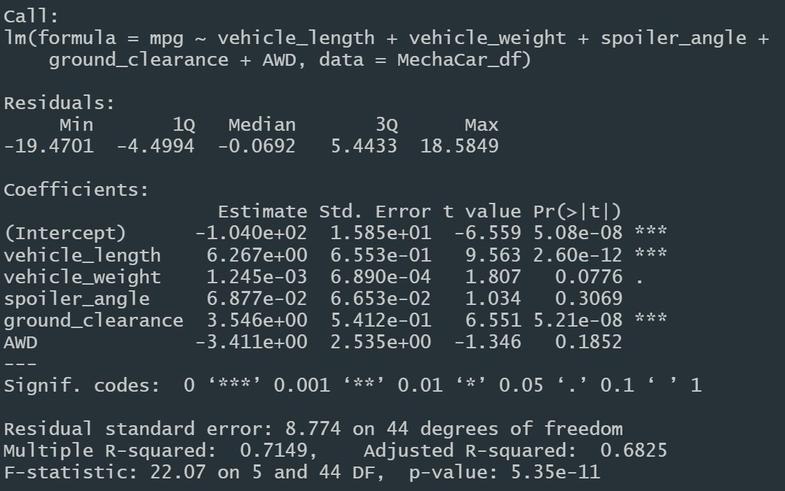
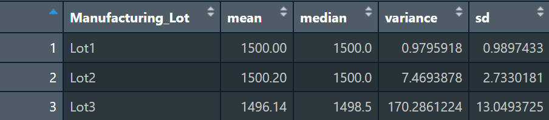
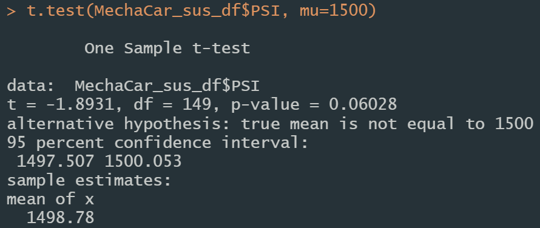
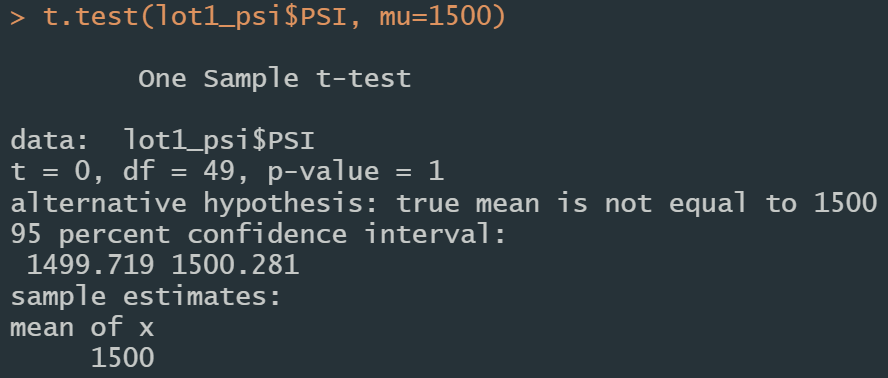
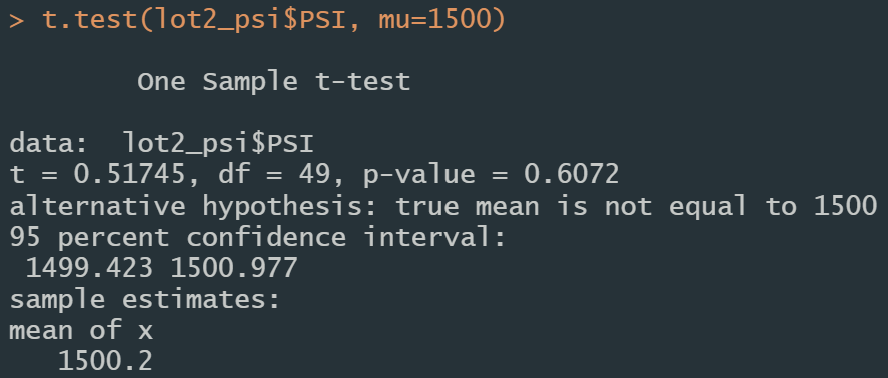
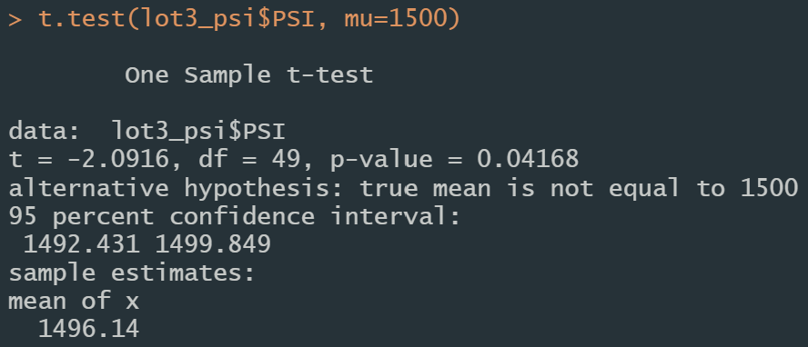

# MechaCar Statistical Analysis

# Overview
The purpose of this project is to use R to analyze MechaCar data to identify key metrics and trends that will help the manufacturing team make decisions about the production process. The data set contains information about the MechaCar prototypes, including vehicle length, weight, spoiler angle, drivetrain, and ground clearance. The data set also contains information about the miles per gallon (MPG) of each prototype. The MechaCar team is interested in understanding how the different variables affect the MPG of the MechaCar prototypes.

## Linear Regression to Predict MPG

### Which variables/coefficients provided a non-random amount of variance to the mpg values in the dataset?

Two variables in this dataset provide a non-random amount of variance: vehicle length and ground clearance. The p-value for each of these variables is less than 0.05, which indicates that they do provide some amount of corelation to the mpg values in the dataset. The p-value of vehicle weight, spoiler angle, and AWD are significantly further from 0.05, which indicates that they do not provide a corelation to the mpg values in the dataset.

### Is the slope of the linear model considered to be zero? Why or why not?

The p-value of the linear model is 5.35e-11, which is significantly less than 0.05. This indicates that the slope of the linear model is not zero. This means that the linear model does provide corelation to the mpg values in the dataset.

### Does this linear model predict mpg of MechaCar prototypes effectively? Why or why not?

This linear model predicts the mpg of MechCar prototypes relatively effectively. The R-squared value is 0.7149, which indicates that 71.49% of the mpg values can be predicted by the linear model. This is a relatively high R-squared value, which indicates that the linear model is a good fit for the data.

## Summary Statistics on Suspension Coils

### Does the current manufacturing data meet the design specification that the variance of the suspension coils must not exceed 100 pounds per square inch in all manufacturing lots in total and each lot individually? Why or why not?

The variance of the suspension coils in all manufacturing lots is 62.29, which does not exceed the required specification. However, breaking the summary statistics down by lot shows that lots 1 and 2 have significantly lower variances than the whole, but lot 3 has a variance of 170.29, which is significantly higher than the required specification. This indicates that the current manufacturing data does not meet the design specification for lot 3.

## T-Tests on Suspension Coils

Performing a t-test to determine if the PSI across all manufacturing lots is statistically different from the population mean of 1500 returns a p-value of 0.06, which is higher than 0.05 and indicates that the PSI across all manufacturing lots is statistically different from the population mean of 1500. However, this is not a largely significant difference as the t-test estimates a mean of 1498.78.

